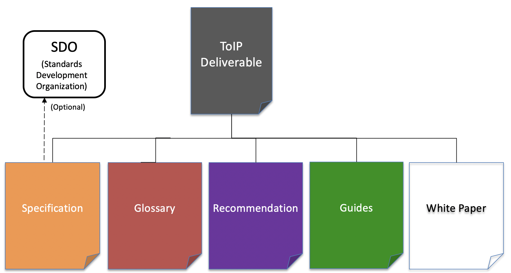

# ToIP Deliverables

Under our Linux Foundation Joint Development Foundation (JDF) charter, each ToIP Foundation Working Group (WG) can produce a variety of [deliverable types](./content/process/work_products.md). This repo covers the [lifecycle management process](./content/process/lifecycle_management.md) for the work products ("deliverables") of the ToIP Foundation.

Figure 1: The five (5) primary types of ToIP Foundation deliverables



Table 1 summarizes the primary differences between these five types:

| Deliverable Type | Designed to be:|
| --- | --- |
| Specification | Implemented (in code)|
| Glossary | Incorporated (in other documents) |
| Recommendation | Followed (in practice) |
| Guides | Executed (in operation) |
| White Paper | Understood (to support decisions) |

Table 1: The primary differences between the six types of deliverables

## Purpose
This repository serves several purposes:

1. Document and maintain the process information for contributing to the ToIP Foundation.
2. Storage and version control for a subset of the Foundation's deliverables.
3. Publication process for our [Deliverables Portal](https://trustoverip.github.io/deliverables), an interactive GitHub Pages website.
4. Manages a list of [industry adoption activity](./lists/adoption.md).

## Contributor's Guide
Contributors of content for the ToIP Deliverables Portal  should familiarize themselves with the [Authoring Process](./DEV_README.md).

## Related Resources

1. [ToIP Deliverables Portal - Status](https://trustoverip.github.io/deliverables/results/proposed/)
2. [ToIP Contributor's Workflow](https://trustoverip.github.io/deliverables/process/process_concepts/)

### Management of Deliverables

#### Publication Categories
Each deliverable produced by the ToIP Foundation may be rendered for publication in a variety of formats. There are two categories:

| Publication Category | Description | Format Options |
| --- | --- | --- |
| Basic | A work-product delivered in only one format. | Markdown |
| Multi-Modal | A work-product delivered in multiple formats. | Markdown, PDF, HTML|

>Note: Regardless of publication category, the authoring process may leverage more than one Markdown file to produce the final work-product.

#### Publication Access
This repo serves as the storage repository for work-products within the **Basic** publication category. These work-products can be found in the ```recommendations``` folder.

Each work-product within the **Multi-Modal** publication category will have a dedicated repository within the [ToIP Github Organization](https://github.com/trustoverip/) with unique publication process details.

### Portal Development  
This repo contains the content resources for the generation of documentation associated with the contribution process and state of our deliverables. It contains the tools necessary to generate this documentation in two rendering formats (printed, online). Please refer to our [Portal Build Process](./content/process/build_processs.md) for more details.

## Getting Started with the ToIP Foundation
The ToIP Foundation maintains a variety of active and inactive activities that adhere to a specific process for the maturation and publication of deliverables that are relevant to:

* Work within the same working group
* Work within another working group
* Work within another community or [SDO](https://en.wikipedia.org/wiki/Standards_organization#Standards_developing_organizations_(SDOs))

There are several ways in which you can get acquainted with our work.

### Learn
If you are here to explore the work products of the ToIP Foundation, we recommend you refer to the *Deliverables Results* section of our [Deliverables Portal](https://trustoverip.github.io/deliverables/results/proposed/) as it provides a current listing of all work product efforts and their statuses.

### Contribute
If you have an idea for a new instance of one of our types of deliverables, please consider making a contribution:

* [Contribute a Specification](./content/process/contributing_specs.md)
* [Contribute a Other Work-Products](./content/process/contributing_other.md)

### Consume
The goal of the ToIP Foundation is to help define a complete architecture for Internet-scale digital trust that combines both cryptographic trust at the machine layer and human trust at the business, legal, and social layers. Our work products with be positioned at various levels of such an architecture and will mature at disparate rates. Please familiar yourself with the [lifecycle management process](./content/process/lifecycle_management.md) for our deliverables and then when/where appropriate we welcome your feedback on how you plan or have consumed our work. Please keep us informed of your activities by submitted a `pull-request` against our [adoption matrix](./lists/adoption.md).

## About

#### License

This repository is licensed under an [Apache 2 License](LICENSE). It is protected by a [Developer Certificate of Origin](https://developercertificate.org/) on every commit. This means that any contributions you make must be licensed in an Apache-2-compatible
way, and must be free from patent encumbrances or additional terms and conditions. By raising a PR, you certify that this is the case for your contribution.

#### Acknowledgement

This repo was derived from the [ToIP Material for MkDocs Repo](https://github.com/trustoverip/mkdocs-material). It was inspired by the structure and successful experience of the [Hyperledger/Aries-RFC Repository](https://github.com/hyperledger/aries-rfcs), which was in part based on [Indy HIPEs](
https://github.com/hyperledger/indy-hipe), which borrowed it from [Rust RFC](https://github.com/rust-lang/rfcs).
