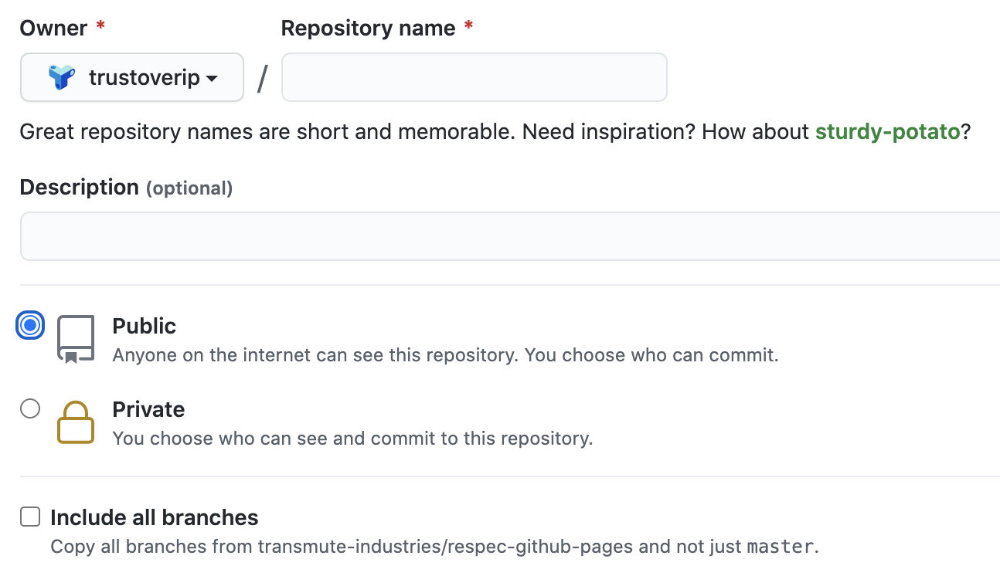

## Purpose
These contribution instructions SHOULD be used when the following are all *true*:

0. The ToIP Deliverable **is not** an instance of a Specification.

1. The contributors have decided to collaborate using an assembly of multiple markdown files as their authoring approach.

2. The contributors have decided that the subject deliverable will need to be published in a variety of formats.

3. The contributors have decided to leverage the ToIP themed MkDocs Authoring Environment.


## Target Repository
All deliverables that fall under the [Multi-Modal Publication Category](./work_product_mgmt.md#publication-categories) will require the creation of a dedicated workspace using a [GitHub Repository (repo)](https://docs.github.com/en/free-pro-team@latest/github/creating-cloning-and-archiving-repositories/about-repositories). We use standard GitHub activities to track issues and feature requests, as well as accept all Pull Requests (`PR's`) related to the deliverable managed by this new dedicated repo.

Contributors to the new the ToIP Foundation repo SHOULD use easy and transparent activities for:

* Reporting a bug
* Discussing the current state of the ToIP Deliverable
* Submitting a fix
* Proposing process recommendations
* other

## General GitHub Workflow

* [Issue Submission / Tracking](./github-issues.md)
* [Pull requests](./github-pullrequests.md)
* Organization Resources
    * [Code of Conduct](./code_of_conduct.md)
    * [ToIP GitHub Organization Management Policy](https://github.com/trustoverip/admin/blob/master/GITHUB_ORG_MANAGEMENT_POLICY.md)
* General GitHub Resources
    * [Issue Creation](https://help.github.com/en/github/managing-your-work-on-github/creating-an-issue)
    * [PR Creation](https://help.github.com/en/github/collaborating-with-issues-and-pull-requests/creating-a-pull-request)
    * [Creating a PR from a Fork](https://help.github.com/en/github/collaborating-with-issues-and-pull-requests/creating-a-pull-request-from-a-fork)

## Preparation

Before proposing a new deliverable, consider the following preparatory actions:

1. Exploring the idea in the appropriate WG Slack Channel.
2. Socialize the idea during a WG meeting.
3. Make use of the mailing lists to socialize the idea and to make an assessment that your proposal is novel and you will not be overlapping work already proposed.
4. Make use of the [Deliverables Portal](https://trustoverip.github.io/deliverables/) for a current listing of all work product efforts and their statuses so that you can appropriately position your proposal as unique.
5. Make a decision as to the [type of deliverable](./work_products.md) you will be proposing.
6. Discuss the roles each contributor will perform. Some members may be knowledgable content contributors, some may be skilled in GitHub, other may have both skills.  
7. Establish a preliminary outline for the content you will be delivering and who may be contributing specific sections of work.


## Proposal Readiness

### Gather Details
The contributors need to gather some specifics before getting started:

1. Familiarize themselves with our [deliverable naming conventions](./work_product_mgmt.md#naming-convention)
2. Select the appropriate `<TypeIndicator>`
3. Obtain a unique `<4digitID>`: When you are ready to create your new deliverable repository you will need to obtain a unique deliverable identifier. To assign a number to your deliverable [visit this web page](https://trustoverip.github.io/next-deliverable-num/).
4. Settle on a clear and concise `<DeliverableName>` that is descriptive, yet not verbose or vague.

### Create Dedicated Repository

The ToIP Foundation provides a [GitHub Template Repository](https://docs.github.com/en/free-pro-team@latest/github/creating-cloning-and-archiving-repositories/creating-a-template-repository) to allow contributors to quickly and easily configure a new dedicated deliverables repository. The [ToIP MkDocs Material Theme](https://github.com/trustoverip/mkdocs-material) Template Repository allows ToIP contributors to create new repositories with the directory structure, branches, and files necessary to bootstrap the development of a [Multi-Modal Publication](./work_product_mgmt.md#publication-categories) using a ToIP branded version of [MkDocs](https://www.mkdocs.org/).

1. Visit [ToIP MkDocs Material Theme](https://github.com/trustoverip/mkdocs-material) Template Repository.
2. Click on the `Use this template` button

3. Fill out the repo creation form using the appropriate naming convention as depicted below:

    * Make sure the `trustoverip` is the owner Organization
    * Follow our [deliverable naming conventions](./work_product_mgmt.md#naming-convention) to enter a repository name such as `WP0120-utility-creation-lessons`
3. Select `Public` as the commit permissions
4. Click on the `Create repository from template` button and wait for GitHub to create and prime your new repo.
5. Visit the new repo and invite your fellow contributors by accessing the repo's `Manage Access Settings`


### Coordination of roles
The stakeholders of this new deliverable, typically members of a task force commissioned by a ToIP WG, will need to gather make few decisions:

1. What is the initial outline of the deliverable? Suggestions are available in the ```templates``` folder of the [deliverables repo](https://github.com/trustoverip/deliverables).
2. Who will act as content authors and/or GitHub committers?
3. How will the contributors coordinate the assignment and delivery of Markdown files to the GitHub committers?
4. How will the sections of the deliverable outline be assigned to content authors?

### Prepare Proposal
One of the members of the contributing team needs to prepare and submit the initial proposal draft. This should include the following:

0. Open an Issue against the new repo. Use a title such as "Prime pump for new deliverable <TypeIndicator><4digitID>"
1. [Fork and clone](https://docs.github.com/en/free-pro-team@latest/github/collaborating-with-issues-and-pull-requests/about-forks) the new repository.
2. In a terminal window, change directories to the parent folder of your newly cloned repo.
3. Rename the current README file to DEV_README

  ```

  [~/new-repo]
  ==>  cp README.md DEV_README.md

  ```

4. Edit the README.md file and replace all existing content with the content from the appropriate **template** file from the [deliverables repo](https://github.com/trustoverip/deliverables) `/template` folder.

    1. Using your browser, navigate to the [deliverables repo](https://github.com/trustoverip/deliverables)
    2. Click on the `/templates` folder
    3. Find the applicable template file and click on the `Raw` button to open a browser window displaying the raw Markdown text.
    4. Using your browser, select all the text, copy it to your clipboard and paste it into the `README.md` replacing all existing text.
    5. At the top of your file modify the title so it is in the form:

        ```
        <TypeIndicator><4digitID>: Friendly Version of Your Title.
        ```

    6. Minimally complete the `Title` and `Summary` sections of the `README.md`.
    7. Consider how your new proposal should be [tagged](./tags.md).


5. The **template** file provides an outline to guide your work. Use the outline to bootstrap your work on the deliverable. [Use MUST and SHOULD per standard conventions](https://tools.ietf.org/html/rfc2119). Put care into the details! Deliverable submissions that do not present sufficient information as suggested by the **template** tend to be poorly received.

## Submit Proposal Draft

1. Commit your changes and submit a PR using previously opened issue.

2. Open an Issue against the [Deliverables Repo](https://github.com/trustoverip/deliverables). Use a title such as "Add new proposal <TypeIndicator><4digitID>"
3. [Fork and clone](https://docs.github.com/en/free-pro-team@latest/github/collaborating-with-issues-and-pull-requests/about-forks) the [Deliverables Repo](https://github.com/trustoverip/deliverables).
4. Commit an updated version of `../results/proposed.md` and push your changes.
5. Submit a pull request using the previously opened Issue.

* Make sure that all of your commits satisfy the [DCO requirements](https://github.com/probot/dco#how-it-works) of the repo and conform to the license restrictions noted [below](#intellectual-property).
* The ToIP Deliverable Maintainers will check to see if the process has been followed, and request any process changes before merging the PR.
* When the PR is merged, your deliverable is now formally in the **Proposed** state.

## Repo generation configuration

1. Delete the  `mkdocs.spec.yml` file, which is located at the root of the project.

2. Follow the instructions for generation of a single Markdown File using the [Combine Tool](https://github.com/trustoverip/mkdocs-material#combined-markdown-file).

3. Follow the instructions for the generation of a PDF. **TODO**

## Repo organization suggestions
You can add supporting artifacts and organize your repo filesystem structure as desired. You MAY want to:

* Create an `images` folder to store `.jpg` and `.png` files that your content may reference.
* Leverage [PlantUML](https://en.wikipedia.org/wiki/PlantUML) tools for the generation of UML diagrams. When doing so, you MUST include in your folder:
    * Source: `.puml` files in a `puml` folder
    * Output: `.jpg` or `.png` files
* Leverage presentation tools (i.e.: PowerPoint, Keynote). When doing so, you MUST include in your folder:
    * Source: `.ppt` or `.key` files
    * Output: `.jpg` or `.png` files

      ```

      /images
        /src
          /puml
            interaction_diagram.puml
          /presentations
            diagrams.key
            slides.ppt
        interaction_diagram.svg
        interaction_diagram.png
        interaction_diagram.jpg
        diagram_1.png
        slide_1.jpg

      ```

## Iterate on Proposal
The contributors of this new repo can now focus on the authoring of content. Iterative updates to the repo reflecting work by contributors will depend on the decisions made by the contributors in the [Authoring Coordination Approach](#coordination-of-roles).

## Submit Proposal for Approval
Once the proposal is ready for review and approval by the sponsoring WG, the contributors should follow our [Lifecycle Management Process](./lifecycle_management.md#process-stages).
