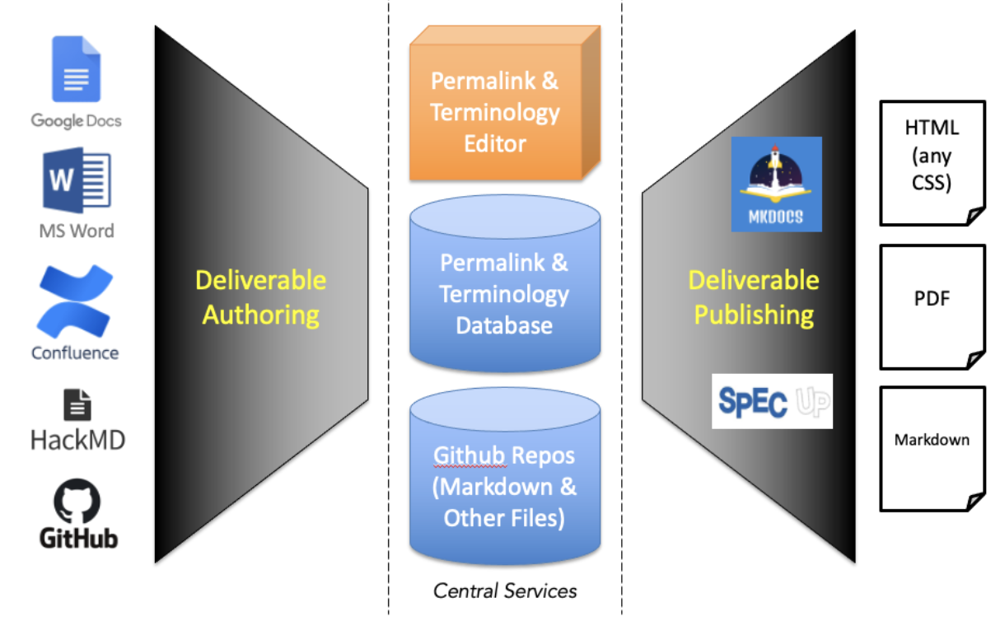

## Introduction
The intent of the ToIP Foundation's approach to the development of [deliverables](./work_products.md) is to enable a simple, standardized and semi-automate production process while maximizing leverage of existing tooling and minimizing dependence on external vendors or custom code.

## Requirements

1. **Authoring Tool Agnostic**: Foundation processes SHOULD NOT dictate which tools should be used for the authoring of content.
2. **Plaintext Authoring Language**: Foundation processes MUST establish a baseline content format for the writing of content during the development of our various deliverable types. [Markdown](https://www.markdownguide.org/) is a simple and easy-to-use markup language that will format virtually any document for easy sharing between computers, mobile phones, and people. Formatting text in Markdown has a [very gentle learning curve](https://www.markdowntutorial.com/).
3. **Processing Tools**: Foundation processes SHOULD establish a common set of styling options so that members of Work Groups and Task Forces can to generate ToIP branded work-products that are consistent across the Foundation and acceptable at the SDO level.
4. **Online Directory**: Foundation processes SHOULD have a simple one-stop-site for all ToIP deliverables that provides a simple directory of our work-products that DOES NOT require GitHub access.

## Conceptual Approach

## Stage 1: Authoring
Our desired approach will *leverage existing authoring tools* for three reasons:

1. These are the tools ToIP members already know.
2. They support a wide range of technical knowledge.
3. The Foundation does not need to make any investment into their development or support (beyond producing template files (outlines) for our different deliverable types).

All of these tools can store files in their native formats and locations until they need to be converted into Markdown and contributed into a Github Repository.

## State 2: Central Services

### Github Repositories
This is the standard file storage and version control system used by Linux Foundation projects. Our desired approach requires that we standardize how we used GitHub in order to support a permalink service.

### Permalink and Terminology Database
The Concepts and Terminology Working Group will determine the   tooling it will need to provide a database that permits mapping relationships and adding labels and tags to terms and their definitions. Note that the definition of each term could be written to GitHub as a Markdown file.

### Permalink and Terminology Editor
It is anticipated that the Concepts and Terminology Working Group  will develop and maintain a content management tool for terms in order to provide permalinks for all ToIP deliverables.

## Stage 3: Publishing
The publishing process must enable each deliverable stored in Github to be published in all required formats, including HTML (styled according to one or more ToIP Foundation standard CSS files), PDFs, and aggregate Markdown files.

## Conclusion

The selection of the Markdown Language allows members freedom of choice when authoring content.  Markdown files can be pre-processed using **existing open-source tools** to minimize costs and dependencies. [MkDocs](https://www.mkdocs.org/) and [Spec-Up](https://identity.foundation/spec-up/) are flexible publishing platforms that leverage the Markdown language and can easily be themed to provide flexibility and consistency.
