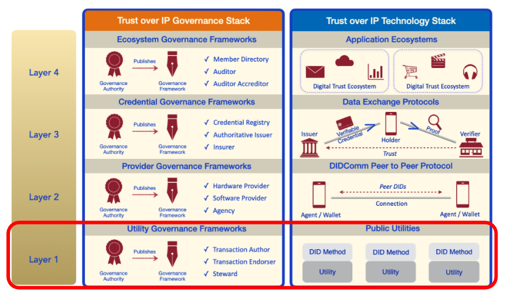

# BP0014: Utility Evaluation Framework
- Authors: [Mathieu Glaude](mathieu@northernblock.ca), [Dan Gisolfi](dan.gisolfi@gmail.com)
- Deliverable Type: *Recommendation - Best Practice*
- Status: [PROPOSED](https://trustoverip.github.io/deliverables/process/lifecycle_management/#proposed)
- Since: 2020-12-09 (date you submit your PR)
- Status Note: *Work-in-progress*
- Supersedes: NA
- Start Date: 2020-12-09
- Tags: #ufwg, #recommendation

## Summary
The main objective of this document is to provide a framework for guidance on how to evaluate existing *Public Identity Utilities (PIU)*. Note that in this document, we will solely focus on blockchain-based public identity utilities. The framework described below is meant for organizations/ecosystems who want to operationalize the Trust over IP stack to choose the best possible PIU that is aligned to their needs.

## Motivation
Who will get value from this framework:

- Organizations/Ecosystems who want to evaluate an existing public identity utility using a framework to project the highest ROI and minimized risks.
- Organizations/Ecosystems interested in convening a new public identity utility to have a framework to evaluate what is out there today and what market gap their utility can fill.

## Introduction to Public Identity Utilities (PIU)
The core purpose of every Public Identity Utility (PIU) is to offer a mechanism to achieve verifiability of data, by assuring the provenance and fidelity of specific data items is stored immutably on a blockchain.

The PIU is the foundation of the Trust over IP stack, providing a root of trust for decentralized ecosystem solutions to thrive.

This best practice document is the result of multiple interviews that were conducted in October 2020, between members of the Utility Foundry Working Group and various utility project conveners. We spoke with conveners and participants of these following PIUs:

| PIU | Description|
| --- | --- |
| [Sovrin](https://github.com/trustoverip/utility-foundry-wg/blob/master/workflow/stories/sovrin.md) | The Sovrin Foundation is a nonprofit organization established to administer the Governance Framework governing the Sovrin Network, a decentralized global public network enabling SSI on the internet.|
| [Bedrock](https://github.com/trustoverip/utility-foundry-wg/blob/master/workflow/stories/bbu.md) | The Bedrock Consortium is a collection of international private sector companies that operate the Bedrock Business Utility (BBU), an independent self-governed non-profit legal entity.|
| [IDUnion](https://github.com/trustoverip/utility-foundry-wg/blob/master/workflow/stories/IDunion.md) | The IDUnion consortium (formally known as SSI for Germany) is a public private partnership of companies and institutions, which implement and govern the IDunion utility. |
| [Indicio.tech](https://github.com/trustoverip/utility-foundry-wg/blob/master/workflow/stories/indicio.md) | Indicio.tech was created to fill a need in the SSI community. Indicio's mission is to provide the professional services needed to build decentralized identity products.|
| [uPort](https://github.com/trustoverip/utility-foundry-wg/blob/master/workflow/stories/uport.md) | Unlike most active utility projects, uPort believes in permissionless ledgers and uses Ethereum as their PIU.|

## Defining Your Ecosystem Solution Requirements
In creating business cases around technology, people often use a simple framework of *Business*, *Legal* and *Technology* as being areas of which to use within business decisioning processes. A common mistake innovators should try to avoid is to start with technology requirements, before considering the business and legal requirements. With decentralized stacks such as the Trust over IP one, it’s critical to also take *Social* and *Governance* elements into consideration.

| Requirement | Description|
| --- | --- |
| Business | The critical activities of an enterprise that must be performed to meet the organizational objective(s) while remaining solution independent.|
| Legal | Any compliance requirements placed on an ecosystem or participants within the ecosystem that pertain to a range of laws such as financial regulations, tax obligations, and privacy  regulation.|
| Technology | The range of technical issues that must be addressed to successfully complete a PUI project. These include but are not limited to performance, reliability, and availability.|
| Social | It’s important for my ecosystem to create value for the society and also generate income (if not wealth). Our solutions must be innovative, unique, people and environment friendly. Examples of social requirements can include transparency, inclusivity, diversity and accessibility. Beyond helping curb those global challenges, sustainability can drive business success. Several investors today use Environmental, Social, and Governance (ESG) metrics to analyze an organization’s ethical impact and sustainability practices. Investors look at factors such as a company’s carbon footprint, water usage, community development efforts, and board diversity.|
| Governance | The collection of governing processes required by the PUI to be successful and sustainable. |

These are not only the elements you want to use to evaluate your own project requirements, but also to evaluate existing PIUs features.

## Evaluating a PIU with Three (3) Best Practices

One must conduct research on an existing PIU based on the same factors that they evaluated their own project requirements. Luckily we have started this process for you by documenting the [stories of various PUI projects here](https://github.com/trustoverip/utility-foundry-wg/tree/master/workflow/stories).

Once you do this, you should be capable of having this table below filled out for comparison purposes. This is the first piece of due diligence. If there is no synergy between your requirements and the offering from the PIU, you will need to look for other options.

| Best Practices | [BP0015 - Assessing Sustainability](../BP0015-assessing-utility-sustainability/BP0015-assessing-utility-sustainability.md)| [BP0016 - Determining Affordability](../BP0016-determining-utility-affordability/BP0016-determining-utility-affordability.md) | [BP0017 - Assessing Alignment](../BP0017-assessing-utility-alignment/BP0017-assessing-utility-alignment.md) |
| --- | --- | --- | --- |
|  | How will a particular PIU deploy a business model that will ensure long-term operational success? | What budgetary and cost questions should be considered when evaluating a PIU? | How to evaluate alignment to a PIU against your ecosystems goals and objectives?|
| 1. Business | | | |
| 2. Legal | | | |
| 3. Technology | | | |
| 4. Social | | | |
| 5. Governance | | | |
| **Scores** | x/10 | y/10 | z/10 |

## Making a Decision
From the previous table, you should be able to total the scores to see if there’s a fit or not. We’re using two different measures here:

* Cumulative: ToIP can recommend a minimum totaled threshold;
* Individual minimums: Individual assessors can set their own thresholds by metric.

If you don’t meet the thresholds, you may want to keep exploring for other projects or you may want to consider convening your own project.

## To-Do Items

1. Socialize this within ToIP organization;
2. Continue research on utility projects;
3. Create v1 documents of 3 Best Practices listed above.
