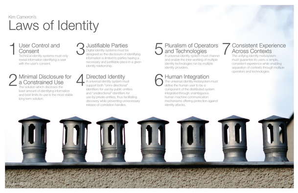

# DP0003: Laws of Identity

-   Authors: [Chris Buchanan](http://cjb@mitre.org), [Darrell
    O'Donnell](http://darrell.odonnell@continuumloop.com), [Victor
    Syntez](http://victorsyntez@gmail.com)

-   Deliverable Type: *Recommendation - Design Principle*

-   Status:
    [PROPOSED](https://trustoverip.github.io/deliverables/process/lifecycle_management/#proposed)

-   Since: 2020-10-21

-   Status Note: Draft

-   Supersedes: N/A

-   Start Date: 2020-10-21

-   Tags: #tswg, #gswg, #recommendation

## Summary

[**The Laws of
Identity**](https://www.identityblog.com/stories/2005/05/13/TheLawsOfIdentity.pdf)
were published by Kim Cameron, Architect of Identity at the Microsoft
Corporation, in 2005. This document serves to recognize this work as a
foundational collection of design principles for a unifying identity
metasystem (referred to henceforth as an ecosystem, to align with Trust
over IP (ToIP) Foundation terminology) that provides an identity layer
for the Internet. The seven laws outline the properties with which any
identity solution must be imbued to meet the hyperdynamic needs of the
entire internet. Cameron's seven laws predated the nascent technologies
and standards with which we now seek to realize his prescient
declaration. While we regard these laws as incomplete (in that more laws
must certainly exist regarding [dependent
identity](https://github.com/trustoverip/concepts-and-terminology-wg/issues/34)),
they have no less efficacy in the context of an [independent
identity](https://github.com/trustoverip/concepts-and-terminology-wg/issues/35).
Therefore, we stand "on the shoulders of giants" as we make the
evolutionary leap to decentralized identity by applying ***The Laws of
Identity*** to our contemporary efforts to build the universal identity
ecosystem described by Cameron et. al.

## Motivation

***The Laws of Identity*** as defined by Kim Cameron et.al. remains a
foundational document in defining an identity system for the Internet.
***The Laws of Identity*** posit that, because the Internet itself is an
ecosystem composed of competing protocols and interoperability standards
without a centralized mechanism of control or enforcement, any identity
ecosystem that intends to service the needs of the Internet must reflect
those properties. Any monolithic identity system will either lack the
span-of-control or the proper context to properly service global needs.
We seek to provide guardrails for future technologies to support the
universal versus the monolithic.

Additionally, while ***The Laws of Identity*** illuminate the path to a
universal identity ecosystem, those of us who seek to realize this
vision are immediately confronted with the global consequences of having
ignored these laws for over a decade due to ignorance, arrogance, greed,
or necessity. The status quo for digital identity, as Cameron warned, is
experiencing "a wake of reinforcing side-effects that \[will\]
eventually undermine all resulting technology." By focusing on
authentication, we have required the ever increasing accumulation of
data which, because it is used for authentication, is imbued with value
beyond its natural state. This accumulated data attracts those who would
exploit its value and, once the data is exploited, the only cure for the
resulting vulnerability is to accumulate more data thus restarting the
cycle. This accumulation to exploitation cycle *is* the reinforcing side
effect of authentication.

To break this cycle, authentication must be decentralized, and
verification must become the predominant trust mechanism. Of course this
has always been the way of identity systems. Authenticate at the edge,
then verify once authenticated. However, by creating a universal
identity system, authentication is pushed off of the internet entirely.
Instead it becomes the domain of the agents and devices which represent
our presence on the internet. In so doing, the accumulation cycle can be
broken and sanity restored. However, a new problem is created:

***How do we trust the verifiable credentials presented to us?***

Enter the Trust over IP Foundation. Conceived in order to solve this
question, the Trust over IP Foundation seeks to enable the universal
identity ecosystem by solving the biggest question that faces the
digital identity ecosystem in accordance with ***The Laws of
Identity***.

## Approach

Since ***The Laws of Identity*** are indicative versus prescriptive,
this document, by mapping each law to each Layer of the Trust Over IP
Technology stack, is intended to guide design decisions rather than
prescribe them. This is not to say they may be dismissed entirely, but
that there is a necessary flexibility of application given the
incredibly diverse and complex use cases that arise within the identity
ecosystem. This mapping will inform the members of Trust Over IP
Governance and Ecosystem Working Groups in their daily work of creating
frameworks, policies, etc. Additionally, it is also recognized that
portions of the decentralized identity ecosystem were not anticipated in
2005 by the authors of ***The Laws of Identity**.* This may lead to
extensions of the laws to reinforce their inclusion within the Trust
Over IP process.

In the provided matrixes, the terms **MUST**, **SHOULD**, and **MAY**
will indicate whether or not documented adherence procedures are
required in accordance with IETF
[RFC2119](https://www.rfc-editor.org/rfc/rfc2119). Additionally, caveats
will be noted for certain issues for which documented adherence is
waived (such as subject consent in guardianship contexts) when it is
otherwise required.

## Outcome

It is important for users and technologists to understand that the ideas
and goals of the Trust over IP Foundation are not new ideas. These
concepts have a strong pedigree that goes back to the origins of the
internet. The Laws of Identity show that any universal identity system
must necessarily be an ecosystem and user centric. However, [***User
Centric
Identity***](https://itlaw.wikia.org/wiki/National_Strategy_for_Trusted_Identities_in_Cyberspace:_Creating_Options_for_Enhanced_Online_Security_and_Privacy)
fell flat, even after its incorporation into the United States National
Strategy, because it depended on governance structures and technologies
that could not hope to achieve the levels of transparency required for
the universal identity ecosystem to be realized. In 2014, The OpenID
Dynamic Discovery system, based on DNS and SSL, provided one approach
which is still in widespread use. Since then, several Distributed Ledger
Technology (DLT) solutions have matured to production levels and further
enhance the technical trust necessary to underpin the universal identity
ecosystem. By acknowledging adherence to the line of thought by which we
have arrived at the present moment, we sweep away the objections of
immaturity and novel approaches and refocus on the important work of
***connecting people while also respecting their individuality of
person, time, place, and context.***

## Scope

This document is intended to be a reference for other Trust over IP
Foundation documents that establish frameworks or policy overlays to the
Trust over IP Governance and Technical Stacks.

## Trust Over IP Stack Layers Descriptions

The first two layers of the ToIP stack are designed to provide
**technical trust** --- the assurance that one machine can establish a
secure, private connection with another machine. Layers Three and Four
are where **human trust** is established and
maintained.{width="6.5in"
height="3.9191174540682416in"}

**TL4:** **Application Ecosystem**. Layer Four is the application
layer---the layer where humans interact with applications in order to
engage in trusted interactions that serve a specific business, legal, or
social purpose.

**TL3:** **Data Exchange Protocols**. Layer 3 is where issuers, holders,
and verifiers exchange credentials and proofs using credential exchange
protocols that run on top of DID Comm.

**TL2:** **DIDComm, CHAPI, and OID-SOIP Peer-to-Peer Protocols**. Layer
Two is about the branches---the digital wallets and digital agents
needed to form secure, private peer-to-peer connections using either
public DIDs (from Layer One) or peer DIDs.

**TL1:** **Public Utilities**. Layer One is about the strong
cryptographic roots of technical trust. ToIP Layer One utilities can be
implemented using any technology that can provide the necessary trust
assurances, e.g., blockchains (of any kind), distributed ledgers,
decentralized file systems, distributed hash tables, and so on.

## Design Goals

System design goals within the Trust over IP ecosystem should adhere to
the Laws of Identity to the extent described below whenever applicable.
Any system that does not adhere to the laws, should have a well
documented exception to explain the variance and mitigations in place to
prevent propagation of negative effects into the larger identity
ecosystem.

The matrices below are a guide for a system to self-assess and document
variances that fall below the Trust over IP Foundation recommended
compliance levels at each layer of the technology stack.

## List of Principles

*ext-image*

### Law 1: User Control and Consent

Digital identity systems must only reveal information identifying a user
with the user's consent. In the case of [dependent
identity](https://github.com/trustoverip/concepts-and-terminology-wg/issues/34),
the subject of the digital identity may not be the user of the digital
identity. This creates a novel case around Control and Consent in which
a solution provider must document both how the subject is protected and
how the user is accountable.

| |    **MUST**  | **SHOULD** |  **MAY** |  **NOT Applicable**|
|:-:|:-:|:-:|:-:|:-:|
|  TL4 |  X |||                             
|  TL3 | X |||                              
|  TL2 || X ||
|  TL1 || X ||

### Law 2: Minimal Disclosure for a Constrained Use

The solution which discloses the least amount of identifying information
and best limits its use is the most stable long-term solution. This
includes concepts such as [[selective
disclosure]{.ul}](https://github.com/trustoverip/concepts-and-terminology-wg/issues/36)
and [[progressive
disclosure]{.ul}](https://github.com/trustoverip/concepts-and-terminology-wg/issues/37)
to prevent oversharing.

| |    **MUST**  | **SHOULD** |  **MAY** |  **NOT Applicable**|
|:-:|:-:|:-:|:-:|:-:|
|  TL4 | X |||                             
|  TL3 | X |||                              
|  TL2 | X |||
|  TL1 | X |||

### Law 3: [[Justifiable Parties]{.ul}](https://github.com/trustoverip/concepts-and-terminology-wg/issues/38)

Digital identity systems must limit disclosure of identifying
information to parties having a necessary and [[justifiable
place]{.ul}](https://github.com/trustoverip/concepts-and-terminology-wg/issues/38)
in a given identity relationship.

| |    **MUST**  | **SHOULD** |  **MAY** |  **NOT Applicable**|
|:-:|:-:|:-:|:-:|:-:|
|  TL4 | X |||                             
|  TL3 | X |||                              
|  TL2 | X |||
|  TL1 | X |||

### Law 4: Directed Identity

A universal identity ecosystem must support both "[[omnidirectional"
identifiers]{.ul}](https://github.com/trustoverip/concepts-and-terminology-wg/issues/39)
for use by public entities and [["unidirectional"
identifiers]{.ul}](https://github.com/trustoverip/concepts-and-terminology-wg/issues/40)
for private entities, thus facilitating discovery while preventing
unnecessary release of correlation handles. No individual system must
support both omnidirectional and directed identity. However, no
underlying technologies should prevent the existence of both types.

| |    **MUST**  | **SHOULD** |  **MAY** |  **NOT Applicable**|
|:-:|:-:|:-:|:-:|:-:|
|  TL4 | X |||                             
|  TL3 | X |||                              
|  TL2 | X |||
|  TL1 | X |||

### Law 5: Pluralism of Operators and Technologies

A universal identity ecosystem must channel and enable the
\[interoperability\] of multiple identity technologies run by multiple
identity providers.

| |    **MUST**  | **SHOULD** |  **MAY** |  **NOT Applicable**|
|:-:|:-:|:-:|:-:|:-:|
|  TL4 ||| X |                             
|  TL3 || X ||                              
|  TL2 | X |||
|  TL1 | X |||

The overall system must allow as many participants as possible. However,
individual credentials and applications do not need to interoperate with
others. Some credentials may be application specific as long as the user
is aware that they are non-compliant.

### Law 6: Human Integration

A unifying identity ecosystem must define the human user as a component
integrated through protected and unambiguous human-machine
communications.

Applications in this ecosystem must include users in identity decisions
and recognize the right of the individual to change their preferences at
any time. Additionally, human integration requires the implementation of
an [[identity
ceremony]{.ul}](https://github.com/trustoverip/concepts-and-terminology-wg/issues/41)
to prove consent. This ceremony, although inconvenient in a way similar
to two-factor authentication, is required for the protection of the
platform, the user, and the trust ecosystem.

| |    **MUST**  | **SHOULD** |  **MAY** |  **NOT Applicable**|
|:-:|:-:|:-:|:-:|:-:|
|  TL4 | X |||
|  TL3 ||| X |                              
|  TL2 ||| X |
|  TL1 |||| X |

### Law 7: Consistent Experience Across Contexts

A unifying identity ecosystem must provide a simple consistent
experience while enabling separation of contexts through multiple
operators and technologies.

The primary intent of ToIP in the enforcement of Law 7 is to prevent
user / developer lock-in to a particular system. Therefore, this
assessment can apply to the developmental decision space if it is not
directly applicable to the system itself. For example, this does not
prevent a layer 2 application from selecting only one layer 1 utility as
long as there is potential for multiple layer 1 utilities (layer 1 is
not proprietary).

| |    **MUST**  | **SHOULD** |  **MAY** |  **NOT Applicable**|
|:-:|:-:|:-:|:-:|:-:|
  TL4  | Below | Adjacent ||                Above
  TL3   |Above / Below | Adjacent (\*)              
  TL2   |Above, Below||| Adjacent (\*\*)
  TL1   |Above || Adjacent | Below 

(\*) Extensibility may count as interoperability to adjacent
technologies.

(\*\*) By virtue of the peer-to-peer nature of this layer the
expectation for interoperability can only be for the protocol chosen and
is not expected to be interoperable with other protocols. However, the
selection of a protocol is therefore determinative of interoperability
from a user perspective. It is therefore imperative that the selection
of TL2 be approached with trepidation while industry coalesces on a
standard.

## Relevance

As Cameron (et.al) points out in *The Laws of Identity*, failure to
adhere to the seven laws "create\[s\] a wake of reinforcing side-effects
that eventually undermine all resulting technology." In other words,
divergence from the seven laws will result in bifurcation of the
technology which can only serve to degrade and dilute the digital trust
ecosystem. There is plenty of room for competition and innovation within
the Seven Laws, but innovating outside of them will amplify the
reinforcing side-effects that plague our contemporary identity ecosystem
. As we venture into areas which the seven laws do not cover such as
[dependent identity](http://./dependent-id.md), we must do so with great
trepidation and purity of purpose; for our responsibility is to codify
the fabric of the future digital society.

## Trade-offs

It's clear that creating any matrix will always result in a border
situation when there is no clear choice between **MUST**, **SHOULD**,
and **MAY**. This shouldn't stop us from thinking about situations when
there is a clear answer and therefore a direct relation between Laws of
Identity and ToIP Technological Stack Layers. We also understand that by
creating such a matrix we might shift focus from the overall fundamental
picture to a more detailed way of looking at governance and ecosystem
frameworks.
